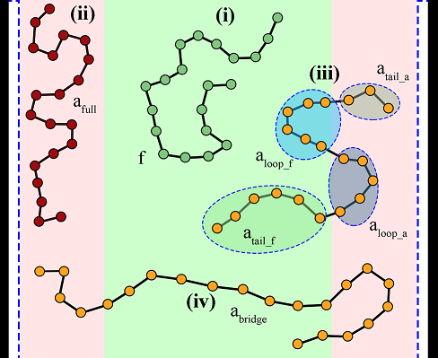

# RuSseL1D
This is the repository of the RuSseL1D code.

The code is named after the British philosopher and mathematician, Bertrand Russell.

It is an open-source code, distributed under the terms of the accompanying LICENSE.

# Authors
- Dr. Constantinos J. Revelas (cjrevelas@gmail.com)
- Dr. Aristotelis P. Sgouros (arissgouros@gmail.com)
- Dr. Apostolos T. Lakkas (tolis1981@gmail.com)
- Prof. Doros N. Theodorou (doros@central.ntua.gr, scientific advisor and mentor)

# Description
RuSseL1D is a code developed in Fortran which applies the Finite Differences method to run one-\
dimensional calculations on heterogeneous polymer systems, based on Self-Consistent Field Theory (SCFT).\
At the moment, the code can address homopolymer melts in contact with solid surfaces and provides with\
useful results regarding the thermodynamics and the structural properties of the system. The solid\
surfaces can be either bare or grafted with polymer chains of the same chemical identity as the matrix chains.\
The code along with its three-dimensional FEM version will be gradually "translated" in C++, so that more\
are potentially attracted to its development.

# Organization
The RuSseL1D repository includes the following files and directories:
 - README          -> current file
 - LICENSE         -> the GNU General Public License of the code (GPL)
 - CMakeLists.txt  -> file controlling the compilation process
 - clean.sh        -> bash script removing all files built by CMake
 - doc/            -> directory containing code documentation
 - examples/       -> directory containing simple test problems
 - src/            -> directory containing the fortran source files
 - run/            -> directory  where the generated executable file is dropped after compilation
 - tools/          -> directory containing the pre- and post-processing tools of the code
 - test_integrity/ -> directory containing integrity tests

To configure and compile the code, type the following commands inside the root directory of the code:
    cmake .\
    make

After successful compilation, the executable RSL1D is created inside the run/ directory

# Short Description of code capabilities
Using this code, it is easy to determine various adsorption states of chains segments\
in the solid or gas interfaces, as shown in the image below.

